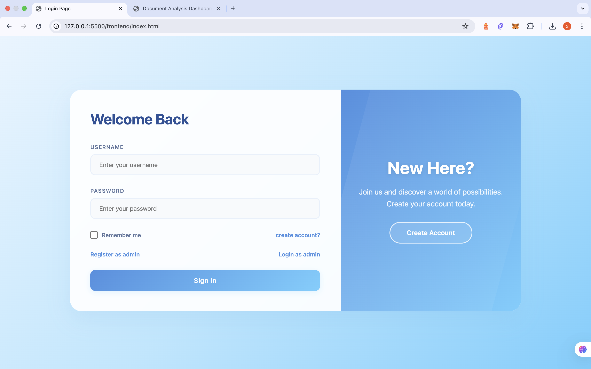
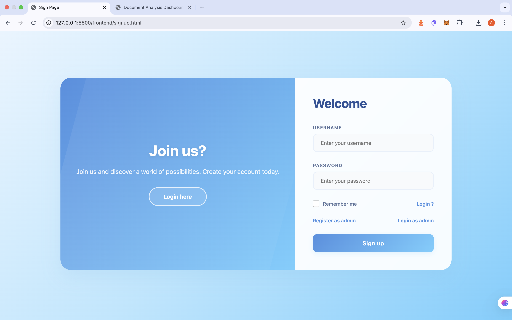
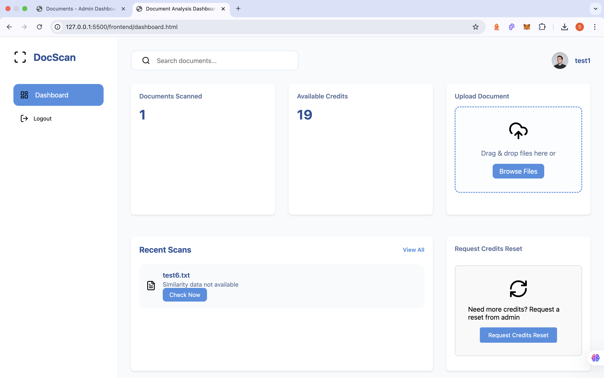
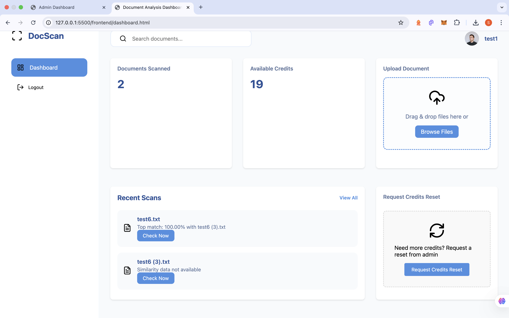
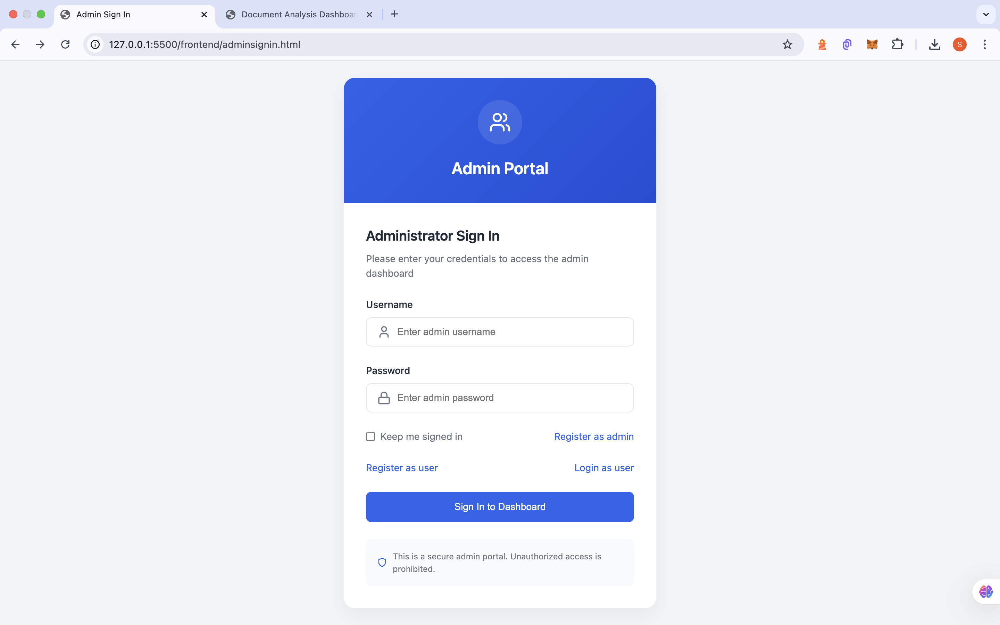
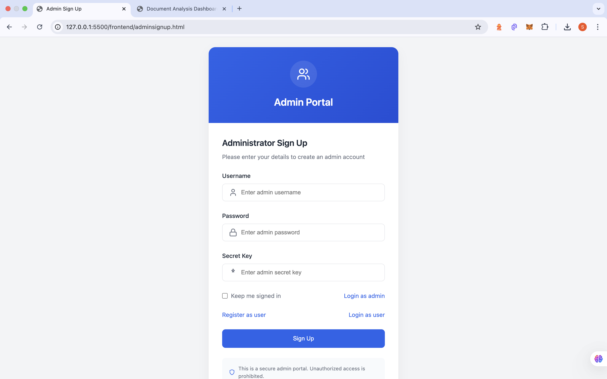
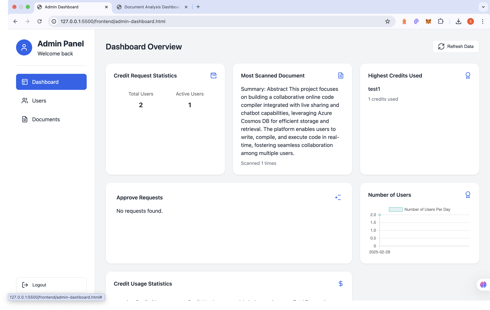
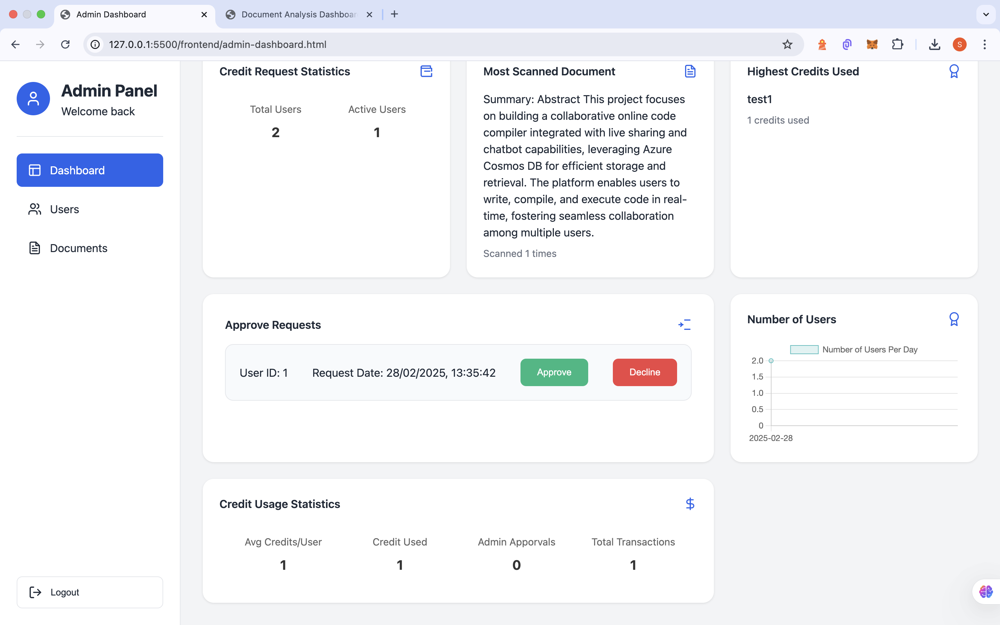
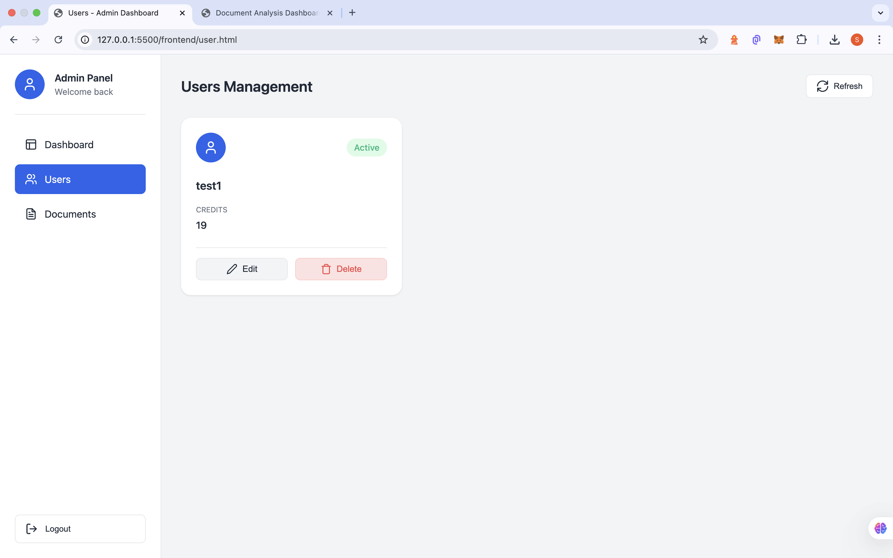
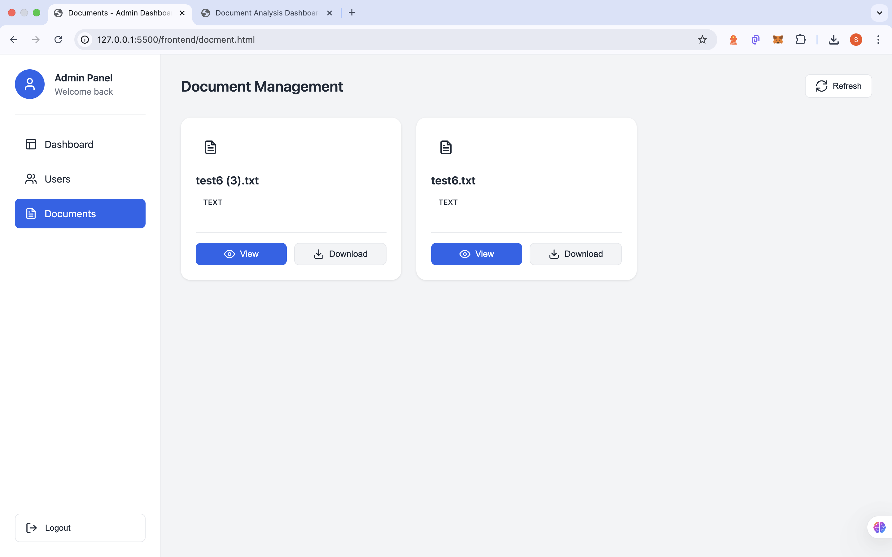

# DocScan - Document Analysis System

## Overview
DocScan is a web-based document analysis system that allows users to upload text documents, scan them for similarities, and manage document analysis results. The system includes user authentication, credit management, and admin features. Used only Express and Cors in backend no external libaries used in backend.In user dash board user have serach feature also

## Technology Stack

### Backend (Node.js)
- **Express.js**: Web application framework
- **SQLite**: In-memory database using node:sqlite in build in node js no external libary used 
- **crypto**: For password hashing and token generation in build libary in node 
- **cors**: Cross-origin resource sharing
- **dotenv**: Environment variable management

### Frontend
- **HTML5/CSS3**: Modern web interface
- **JavaScript**: Pure JavaScript without frameworks
- **Fetch API**: For HTTP requests
- **FormData API**: For file uploads

## Features

### 1. Authentication System
- User registration and login
- Admin registration and login with secret key
- token authentication used custom functions for creating token 
- Password hashing with custom funtion
- Token expiration handling

### 2. Document Management
- Text file upload (.txt files only)
- Document similarity checking
- File storage in uploads directory
- Document listing and search
- File download and deletion (admin only)

### 3. Credit System
- Users start with 20 credits
- One credit per document scan
- Credit reset requests
- Automatic credit reset at midnight
- Low credit notifications

### 4. Admin Dashboard
- User management
- Credit management
- Document oversight
- Analytics and statistics
- User activity monitoring

## Setup and Installation

1. **Prerequisites**
   - Node.js (v23.2 or higher)
   - npm (Node Package Manager)

2. **Installation**
   ```bash
   git clone [repository-url]
   cd backend
   npm install
   ```

3. **Environment Setup**
   Create a .env file with:
   ```
   ADMIN_SECRET_KEY=your_admin_key
   ```

4. **Running the Application**
   ```bash
   # Start backend server
   node backend/index.js

   # Serve frontend
   # Use any static file server like live-server
   ```

## API Endpoints

### Authentication
- POST `/auth/register`: User registration
- POST `/auth/login`: User login
- POST `/auth/admin/register`: Admin registration
- POST `/auth/admin/login`: Admin login
- POST `/auth/logout`: Logout

### User Operations
- GET `/user/credits`: Get user credits
- GET `/user/profile`: Get user profile
- POST `/scanUpload`: Upload and scan document
- GET `/user/documents`: List user documents
- POST `/user/request-credits-reset`: Request credits reset

### Admin Operations
- GET `/admin/users`: List all users
- GET `/admin/documents`: List all documents
- POST `/user/change-credits`: Modify user credits
- DELETE `/admin/delete-user/:userId`: Delete user
- GET `/admin/analytics`: Get system analytics

### Document Operations
- GET `/extractText/:docId`: Extract document text
- GET `/matches/:docId`: Get document similarities using basic test matching algorithm
- GET `/search-documents`: Search documents
- GET `/view-file/:docId`: View file content
- GET `/download-file/:docId`: Download file
- DELETE `/delete-file/:docId`: Delete file

## Security Features

1. **Token-based Authentication**
   - Tokens with expiration
   - Role-based access control
   - Token revocation on logout

2. **Password Security**
   - Salted password hashing
   - Secure password storage
   - PBKDF2 hashing algorithm

3. **File Security**
   - File type validation
   - Unique filename generation
   - Access control per file

## Frontend Features

1. **Dashboard**
   - Real-time credit display
   - Document count tracking
   - Search functionality
   - Drag-and-drop file upload

2. **User Interface**
   - Responsive design
   - Document listing
   - Similarity checking
   - Credit reset requests

3. **Error Handling**
   - User-friendly error messages
   - Loading states
   - Upload progress indication

## Best Practices

1. **Code Organization**
   - Modular structure
   - Separation of concerns
   - Clear naming conventions

2. **Error Handling**
   - Comprehensive error catching
   - User-friendly error messages
   - Proper HTTP status codes

3. **Performance**
   - Debounced search
   - Efficient database queries
   - Proper memory management

## Limitations

1. Only .txt files are supported
2. In-memory database (data lost on server restart)
3. Limited to text similarity checking
4. No real-time updates

## Future Enhancements

1. Support for more file types
2. Persistent database
3. Real-time notifications
4. Advanced text analysis
5. Report generation
6. Bulk upload functionality
## Screenshot

*User login and authentication interface*

*User signup and registration interface*

*User Dashboard showing document analysis interface*

*Document similarity analysis and matching interface*

*Admin login and authentication interface*

*Admin signup and registration interface secuity key in .env file*

*Admin Dashboard showing user and document management interface*

*Credit approval and management interface*

*Admin user management and control panel interface*

*Admin document management and tracking interface*